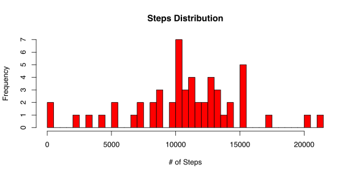
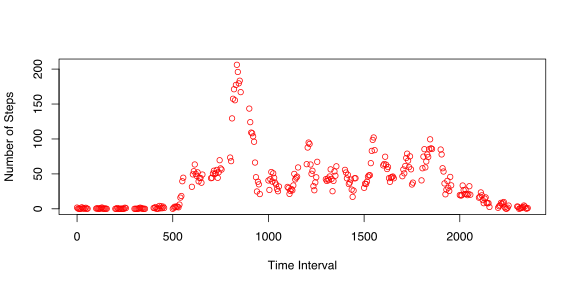

# Reproducible Reseach - Peer Assessment 1
January 17, 2015  

### Loading and Processing data

Firstly, the data is read in from a CSV file and stored in *dat*.  Rows with missing values are removed and this new data set is stored as *step_dat*.  Each row consists of three values:

- *steps*: The number of steps taken during a 5-minute interval

- *date*: The date the data was taken

- *interval*: Identifier of the five minute interval during which the data was taken on the associated date.


```r
dat <- read.csv('../activity.csv')

step_dat <- dat[complete.cases(dat),]
```

###Steps distribution

Below is the histogram for the the number of steps taken in a day.  Missing values are ignored in this tabulation.


```r
days_steps <- aggregate(steps ~ date, sum, data = step_dat)

hist(days_steps$steps, col = "red", main = "Steps Distribution", xlab = "# of Steps",
     breaks = 50)
```

 

The mean and median for steps taken in a day are found via:

```r
mean_steps <- mean(days_steps$steps)
median_steps <- median(days_steps$steps)
```
and are 1.0766 &times; 10<sup>4</sup> and 10765 respectively.

###Time Series Analysis

In order to see the how steps varied throughout the day, the number of steps is averaged for each time interval and across dates:


```r
int_steps <- aggregate(steps ~ interval, mean, data = step_dat)

plot(int_steps$interval, int_steps$steps, ylab = 'Number of Steps', 
     xlab = 'Time Interval', col = 'red')
```

 

The maximum average number steps (206.1698 steps) occurs during the 835th time interval.

###Is missing data biasing the analysis?

Note that there are a number of days/intervals where there are missing values (coded as NA). The presence of missing days may introduce bias into some calculations or summaries of the data.

Calculate and report the total number of missing values in the dataset (i.e. the total number of rows with NAs)

Devise a strategy for filling in all of the missing values in the dataset. The strategy does not need to be sophisticated. For example, you could use the mean/median for that day, or the mean for that 5-minute interval, etc.

Create a new dataset that is equal to the original dataset but with the missing data filled in.

Make a histogram of the total number of steps taken each day and Calculate and report the mean and median total number of steps taken per day. Do these values differ from the estimates from the first part of the assignment? What is the impact of imputing missing data on the estimates of the total daily number of steps?


###Weekend vs. Weekday

For this part the weekdays() function may be of some help here. Use the dataset with the filled-in missing values for this part.

Create a new factor variable in the dataset with two levels – “weekday” and “weekend” indicating whether a given date is a weekday or weekend day.

Separating weekdends and weekdays:


Make a panel plot containing a time series plot (i.e. type = "l") of the 5-minute interval (x-axis) and the average number of steps taken, averaged across all weekday days or weekend days (y-axis). See the README file in the GitHub repository to see an example of what this plot should look like using simulated data.

Panel plot comparing weekends and weekdays:


