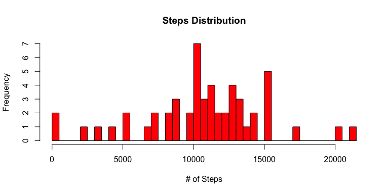
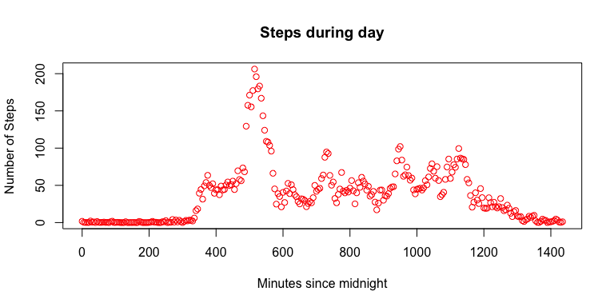
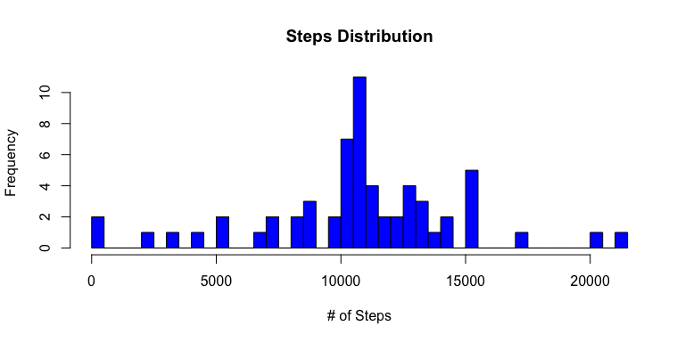
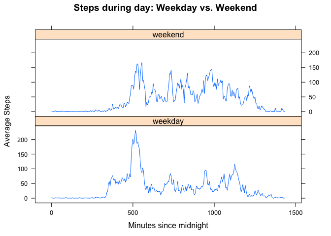

# Reproducible Reseach - Peer Assessment 1
January 17, 2015  

### Loading and Processing data

Firstly, the data is read in from a CSV file and stored in *dat*.  Rows with missing values are removed and this new data set is stored as *step_dat*.  Each row consists of three values:

- *steps*: The number of steps taken during a 5-minute interval

- *date*: The date the data was taken

- *interval*: Identifier of the five minute interval during which the data was taken on the associated date.

Also the time interval variable is convertd to a new variable msince representing the minutes since midnight (interval = 0)

```r
dat <- read.csv('../activity.csv')

dat$msince <- dat$interval %/% 100 * 60 + dat$interval %% 100

step_dat <- dat[complete.cases(dat),]
```

###Steps distribution

Below is the histogram for the the number of steps taken in a day.  Missing values are ignored in this tabulation.


```r
days_steps <- aggregate(steps ~ date, sum, data = step_dat)

hist(days_steps$steps, col = "red", main = "Steps Distribution", xlab = "# of Steps",
     breaks = 50)
```

 

The mean and median for steps taken in a day are found via:

```r
mean_steps <- mean(days_steps$steps)
median_steps <- median(days_steps$steps)
```
and are 1.0766 &times; 10<sup>4</sup> and 10765 respectively.

###Time Series Analysis

In order to see the how steps varied throughout the day, the number of steps is averaged for each time interval and across dates.  The time intervals are labeled XXYY where XX is from 0 to 23 in increments of 1 and YY is from 0 to 55 by 5. These are converted to elapsed time (in minutes) from midnight.


```r
int_steps <- aggregate(steps ~ msince, mean, data = step_dat)

## convert times

plot(int_steps$msince, int_steps$steps, ylab = 'Number of Steps', 
     xlab = 'Minutes since midnight', col = 'red', 
     main = "Steps during day")
```

 

The maximum average number steps (206.1698 steps) occurs during the interval 515 minutes from midnight.

###Is missing data biasing the analysis?

The number of missing values in the dataset is found as follows:


```r
## number of rows with missing data
numna <- sum(is.na(dat$steps))
```

There are 2304 missing values.

To see if ignoring the missing data affects the overall analysis, each row with missing data will be replaced by the average for that time of day.


```r
##Replacing missing data with average number of steps for that time interval

library(plyr)
impute.mean <- function(x) replace(x, is.na(x), mean(x, na.rm = TRUE))
repl_dat <- ddply(dat, ~ interval, transform, steps = impute.mean(steps))
```

A histogram of the imputed data is produced by the following code along with the mean and median calculated: 


```r
mvr_days_steps <- aggregate(steps ~ date, sum, data = repl_dat)

hist(mvr_days_steps$steps, col = "blue", main = "Steps Distribution"
     , xlab = "# of Steps", breaks = 50)
```

 

The mean and median for steps taken in a day with missing values replaced with interval averages are found via:


```r
mvr_mean_steps <- mean(mvr_days_steps$steps)
mvr_median_steps <- median(mvr_days_steps$steps)
```
and are 1.0766 &times; 10<sup>4</sup> and 1.0766 &times; 10<sup>4</sup> respectively.

The histogram changes but the  median and means are unchanged from the un-imputed data.

###Weekend vs. Weekday

Dates are converted to POSIXlt class and a day of the week (DayType) variable is created.  The day of the week is then converted to either weekend (Saturday and Sunday) or weekday (Monday through Friday):


```r
## create mew variable DayType with two levels "weekday"" and "weekend"
repl_dat$DayType <- weekdays(as.POSIXlt(repl_dat$date))
repl_dat$DayType <- ifelse((repl_dat$DayType == "Saturday"),"weekend", 
                           ifelse(repl_dat$DayType == "Sunday",
                                  "weekend", "weekday"))
```
The DayType is converted to a factor and each interval's steps is averaged and plotted:

```r
## Two times series plots broken by DayType
library(lattice)
repl_dat <- transform(repl_dat, DayType = factor(DayType))
int_repl_steps <- aggregate(repl_dat$steps, 
                            by = list(repl_dat$msince, repl_dat$DayType), 
                            FUN = mean, data = repl_dat)
names(int_repl_steps) = c("msince","DayType","steps")
xyplot(steps ~ msince | DayType, data = int_repl_steps, 
       xlab = "Minutes since midnight", ylab = "Average Steps", 
       main = "Steps during day: Weekday vs. Weekend", 
       type = "l", layout = c(1,2))
```

 

There appears to be less morning walking during the weekend (less commuting?) but more afternoon walking (recreation, shopping?).


